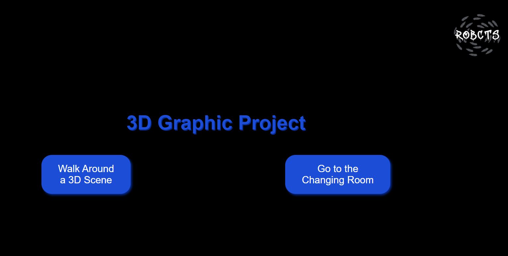

# Interactive 3D Graphics Project
Individual Interactive Graphics project  

<p align="center" margin-top: 20px; margin-bottom: 90px;">
  
</p>

Welcome to the Interactive 3D Graphics Project! This project involves creating a 3D environment where an object moves according to user commands. Below, you will find a detailed breakdown of the project's implementation, challenges, and solutions.  

## Overview
This project aims to create an interactive 3D environment where users can move an object within the space using commands. The environment is designed using Blender and incorporates various textures, animations, and custom lighting. The project also includes a dynamic camera system that follows the moving object, enhancing the user experience.

## Student
| **Matricola** | **GitHub** |
| :---: | :---: |
| `2162601` | [](https://github.com/RobCTs) |

## Table of Contents
- [Features](#features)
- [Installation](#installation)
- [Usage](#usage)
- [Environment creation](#environment)
- [Persona creation](#environment)
- [Animation creation](#environment)
- [Loading and Scripting](#loading)
- [Object Movement](#object-movement)
- [Challenges and Solutions](#challenges)
- [License](#license)


## Features
This project boasts several key features that enhance the user experience and demonstrate the capabilities of combining 3D modeling with interactive programming. The 3D environment includes a wavy plane textured with a mix of ground textures, scattered grass, rocks, and trees for a realistic look. The dynamic skydome features a starry night sky with animated clouds, adding depth and immersion to the scene. Users can control the movement of a character named Nyra within the 3D space, with customizable lighting options to adjust the scene's light and brightness settings to their preference. A dynamic camera system follows Nyra as she moves, providing a seamless and engaging viewing experience.

## Installation
To get started with the project, you need to clone the repository to your local machine using the following command:
```
git clone https://github.com/RobCTs/interactive-3d-environment.git
```

After cloning the repository, navigate to the project directory:
```
cd interactive-3d-environment
```

Once in the project directory, open the index.html file in a web browser to run the project.

## Usage
Once you have the project running in your web browser, , you will be presented with an option to choose between two different scenes:

a) **Main 3D scene**: In this environment, you can interact with the 3D environment. Use the provided on-screen controls or keyboard commands to move Penelope within the environment. Adjust the lighting and brightness settings using the available options to see how the scene changes. The camera will dynamically follow Penelope, providing different angles and perspectives as she moves.

b) **Changing Room scene**: This scene allows you to interact with Penelope by playing different animations. Use the buttons in the Changing Room interface to make Penelope perform actions such as blinking, breathing, walking, and running. 

## Environment Creation
See [ReadME](environment/README.md).

## Persona Creation
See [ReadME](persona/README.md).

## Animation
See [ReadME](animation/README.md).

## Loading and Scripting
The interactive components of the project are implemented using JavaScript and HTML. The HTML file sets up the basic structure of the web page and includes import maps for loading necessary libraries such as Three.js, GLTFLoader, MTLLoader, OBJLoader, lil-gui and OrbitControls.

The JavaScript file initializes the 3D scene by creating a Three.js scene, camera, and renderer. It sets up OrbitControls for smoother and more interactive camera movement and adds ambient and directional lights to the scene to create a realistic lighting environment. The GLTFLoader is used to load the main environment model, while the OBJLoader is used to load the character model, Penelope. Event listeners are set up for keyboard input, allowing users to control Penelope's movement within the scene. The script also includes logic for moving the character based on user inputs and updating the camera position to follow the character dynamically.

For the Changing Room scene, additional loaders and controls are used to load and manage the FBX models and animations. The scene allows users to interact with Penelope by playing different animations through a simple button interface.

## Object Movement and Camera (3D scene)
User commands for moving Nyra are captured and processed using event listeners in JavaScript. The movement logic considers the terrain’s elevation, ensuring Nyra moves smoothly over the wavy plane without disappearing into the ground. This is achieved by implementing a raytracer that calculates the y-coordinate based on the plane’s surface at a given x and z position.

The camera system is designed to follow Nyra, providing a dynamic view that enhances the interactive experience. The camera's movement is restricted to prevent it from going below the ground, achieved by setting limits on the camera’s angle and position. As Nyra moves, the camera smoothly transitions to new positions, maintaining an optimal view of the character and the surrounding environment.


## Challenges and Solutions
Throughout the development of this project, several challenges were encountered and addressed. Initially, the project was developed using multiple JavaScript files for modularity, but this approach proved cumbersome. Switching to Blender for 3D modeling and integrating the models using Three.js streamlined the workflow and improved manageability.

Scattering objects within the environment posed a challenge, as the initial distribution was too uniform. This was resolved by creating a mask to scatter objects in specific areas, enhancing the natural appearance of the scene. Performance issues arose due to the high number of instances for trees and grass, causing lag. The number of instances was reduced to optimize performance, balancing visual fidelity and smooth operation.

Exporting textures and managing emission values also presented difficulties. The scene was often too bright when viewed in OpenGL, requiring adjustments. Baked textures were used, and emission values were carefully tuned to ensure proper export and balanced scene brightness. The interaction between the wavy plane and the moving character was another challenge, with Penelope partially disappearing into the ground instead of moving over the hills. Implementing a raytracer to accurately position Nyra based on the terrain’s elevation solved this issue.

Finally, the camera occasionally moved below the ground, disrupting the view. This was fixed by limiting the camera’s movement angles, ensuring consistent and optimal viewing angles.

## License
This project is licensed under the MIT License. See the LICENSE file for more details.
