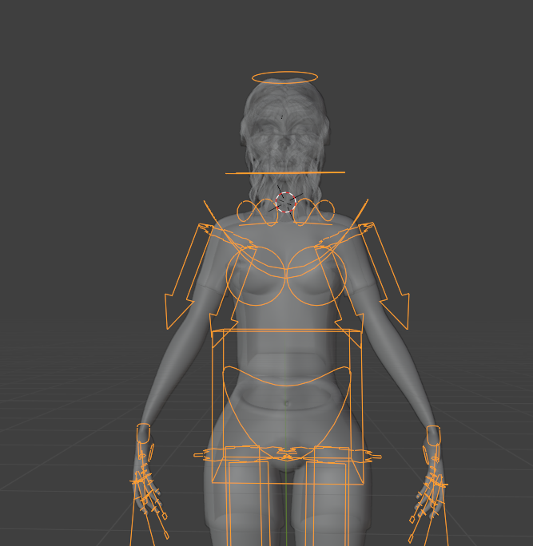
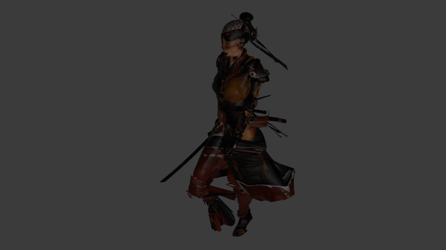
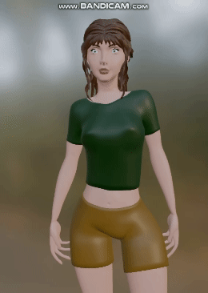
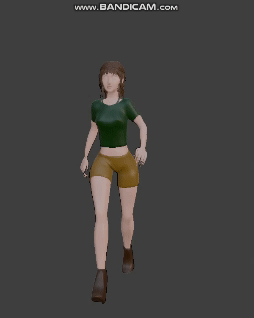

# Animations  
Animations for the Interactive 3D Graphics Project

  

## Overview
This document details the creation and implementation of animations within the Interactive 3D Graphics Project. It covers the evolution of character animation from initial attempts to the final implementation, including the challenges faced and solutions applied. The project features two main scenes: the main 3D environment and the Changing Room scene, each with its unique set of animations for the character Penelope.

## Features
The animations primarily involve the character Penelope performing various actions. These animations are divided into two main scenes:

- **Changing Room Scene**: Penelope performs specific actions such as breathing, walking and running.

- **3D Scene**: Penelope moves within a dynamic 3D environment using predefined animation packs. 

### Rigging
Creating an armature, or skeleton, for the model is essential for animation. This skeleton will serve as the framework for animating the model, allowing for realistic movement and deformation. To create an armature in Blender, I started by adding a single bone to the scene. Switch to Edit Mode, then extrude new bones by selecting the tip of a bone and pressing E. Then I proceed to position and rotate the bones to match the anatomy of the model, ensuring that the bones are properly aligned with the parts of the model they will control.

Once the skeleton is complete, I had to parent the model to the armature by selecting both the model and the armature. You can complete the rigging by choosing to add automatic weights or paint them. This initial setup allowed the bones to control the mesh.

## Creative path
### Initial Attempts with Nyra

  

The animation journey began with Nyra, a character used in previous homework assignments. Initially, I attempted to use JavaScript to create a skeleton for animation. This involved significant challenges, leading me to switch to Blender for sculpting, scene creation, and animations. But there is the draft in the assets folder.

So Nyra was imported in Blender, and a skeleton was created bone by bone (rigging) to be able to animate her. Using Blender's timeline, I animated Nyra by posing the skeleton and keyframing her positions. The animation was then looped to create continuous motion.

Nyra's clothes and textures were not adequately addressed initially. Which were more evident when trying to animate the warrior. Additionally, there were some unnatural joint rotations and pose transitions which required some fine-tuning, I was not yet capable of doing.

### Transition to Penelope
As I progressed, I sculpted a new character, Penelope, in Blender. Once I was done, I adapted Nyra's skeleton for Penelope, starting with simpler animations like breathing.

- a) **Breathing**: I animated the upper torso bones and joints, moving shoulders along the z-axis and spine along the y-axis. Minor twitches in the hand movements were observed, which need correction.

  

- b) **Walking**: For the walking loop I applied constraints to avoid unnatural rotations, specifically addressing issues noticed in Nyra's animation. Although knee movements and the leg's position was adjusted for a more natural walk, the arms and hand movement are still not precise.

  

- c) **Running**: It is based on the walking animation, but with more exaggerated movements for running.
  

  

- d) **Blinking**: Currently still in progress, due to ongoing adjustments and issues with the skeleton and the mesh for realistic eye movements.

## 3D scene optimization
Due to time constraints, and given the complexity and variety of possible movements (e.g., starting to walk, stopping, turning right, turning left), I could not implement all the movements needed. So I just use the three animations I had. An alternative, instead of creating every and each one of those movement, is relying on a predefined animation pack from Mixamo to create these basic movements ensuring smooth performance despite the complexity of the animations.

## Most relevant challenges 
There were several (ongoing) challenges, but for the animation probably the most noticeable was that joints exhibited unnatural rotations, which were solved at a later point with some constraints to limit the movement of a bone on a specific axis.

I also kept forgetting to "Apply All Transforms" (in Blender) or apply the modifier, which caused issues with parenting the skeleton to the mesh or with making any movement in general.

## Future Improvements
**Blinking Animation**: Complete the implementation of the blinking animation.  
**Breathing Animation**: Fix minor tremors in the breathing animation.
**Walking and Running**: Make movements more linear and improve arm and hand animations.  
**Performance**: Further optimize the overall performance for smoother animations.  
**Extra animations**: Create more animations for a more realistic game performance.  

## Conclusion
The animations in the Interactive 3D Graphics Project bring the character Penelope to life, allowing users to interact with her in both the main 3D scene and the Changing Room scene. The process involved overcoming several challenges, but the use of tools like Blender and Three.js made it possible to create realistic and engaging animations.
