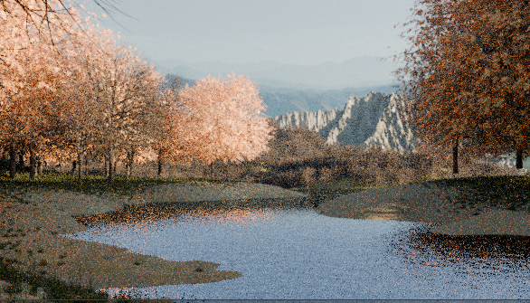
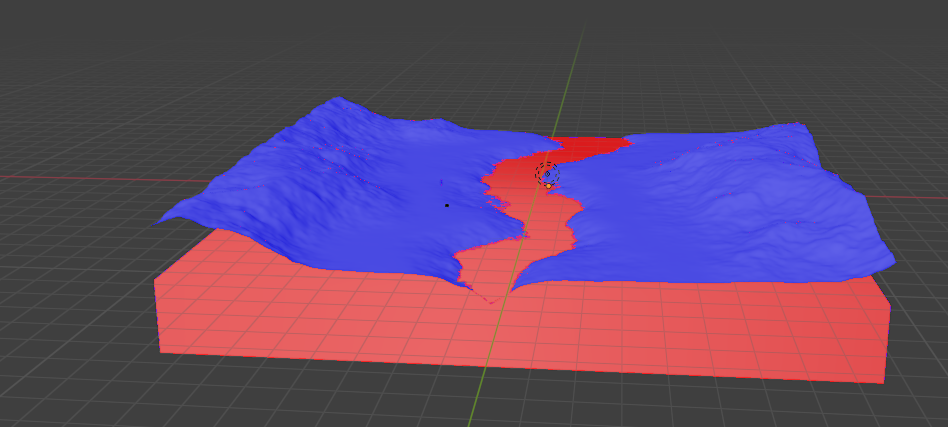
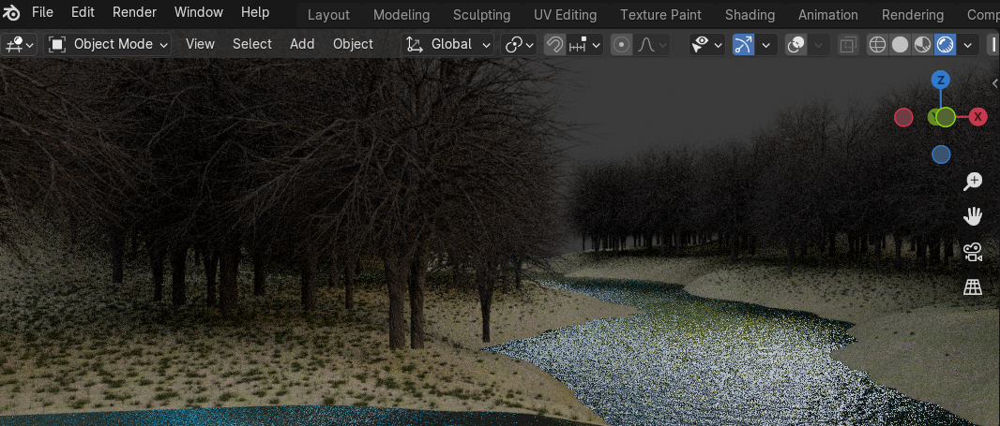
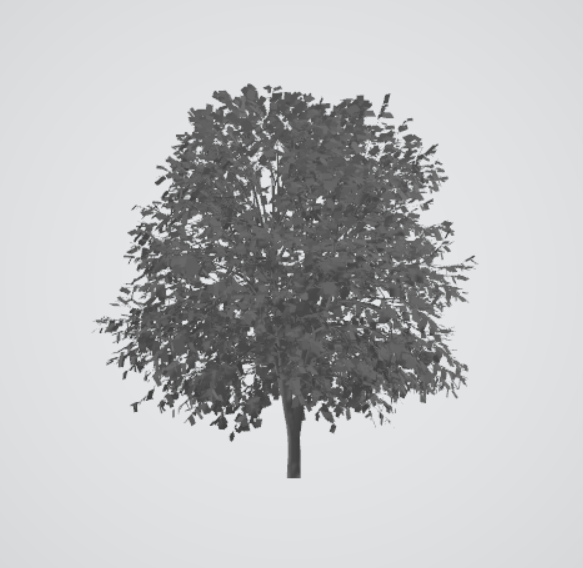
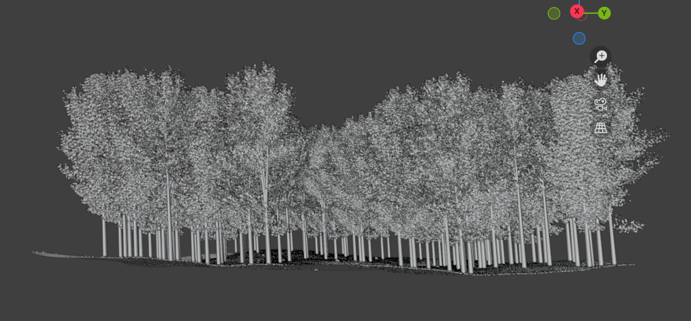

# Interactive Environment
Environment model

 

  

## Overview
The 3D environment is designed as a realistic and immersive scene where a person can move around. It consists of a forest with a river, mountains in the background, and a midground with trees.

## Software and Tools
- **Blender Version**: 4.1  
- **Blender Addons**: ANT Landscape, Node Wrangler, Cycles Render Engine (activated, but no additional plugins used)  
No specific configurations or environments are required for this project. Simply open Blender and begin your modeling process.

## Environment Creation
The environment was meticulously designed in Blender, leveraging its powerful tools and features to create a realistic scene. The foundation is a wavy plane, generated using a cloud texture to simulate natural undulations.

### Ground creation
Start with a plane and use subdivision and a cloud texture to create natural ground undulations. If you activate the landscape addon, you can use a river setup. 

  

  

The ground is dressed with a mix of two ground textures sourced from Poly Haven:([Aerial grass](https://polyhaven.com/a/aerial_grass_rock) and [Forest leaves](https://polyhaven.com/a/forest_leaves_02)). These textures are scaled down to enhance detail and blended together using a Mix Shader to create a seamless ground surface.

Optionally, mask out and create a bit of concaveness for the path. Use a mix of textures for the path: ([Forest earth](https://polyhaven.com/a/forest_ground_04), [Forest ground](https://polyhaven.com/a/forrest_ground_01)).

 

  

### Vegetation and Rocks
To add realism, the environment is populated with scattered instances of grass, rocks, and trees ([Grass](https://polyhaven.com/a/grass_medium_01), [Rocks](https://polyhaven.com/a/rock_moss_set_01)). This was achieved by creating a mask to ensure that objects were scattered in predefined areas, preventing an overly uniform distribution. 

   

  
    

Trees were scattered after creating a tree sample by using the add-on Sapling Tree Gen.

 

  

### Additional elements

  

To enhance the midground, a variety of trees were added to create a dense forest look. Different types and sizes of trees were used to ensure realism and avoid uniformity. The trees were scattered carefully to achieve a natural appearance, utilizing Blender's geometry nodes for efficient distribution.

To further enhance depth perception in the scene, blue fog was implemented. The fog settings were adjusted to create a more realistic atmospheric perspective that adds a sense of scale and immersion.

In the background, mountains were added to frame the scene and provide a majestic backdrop. A high-quality mountain picture was used to create the illusion of distant peaks, blending seamlessly with the midground elements. The background mountains were positioned to complement the overall composition and enhance the sense of depth in the scene.

## Final Scene

  

The final scene consists of a forest with a river, surrounded by mountains and enriched with detailed vegetation and atmospheric effects. The careful placement of trees in the midground, combined with the blue fog and background mountains, creates a rich and immersive environment. This setting provides a realistic and engaging backdrop for interaction, making the scene feel vibrant and alive.
