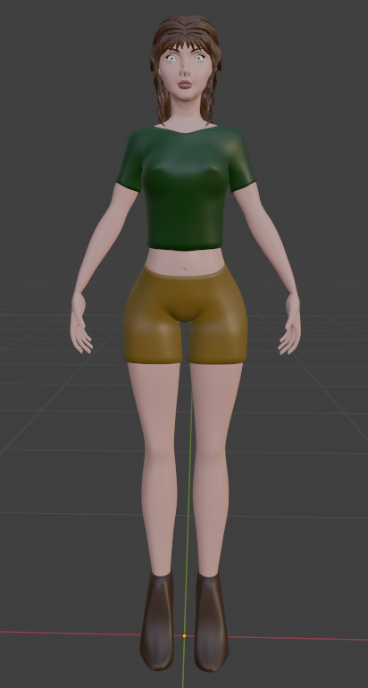
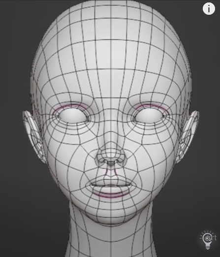
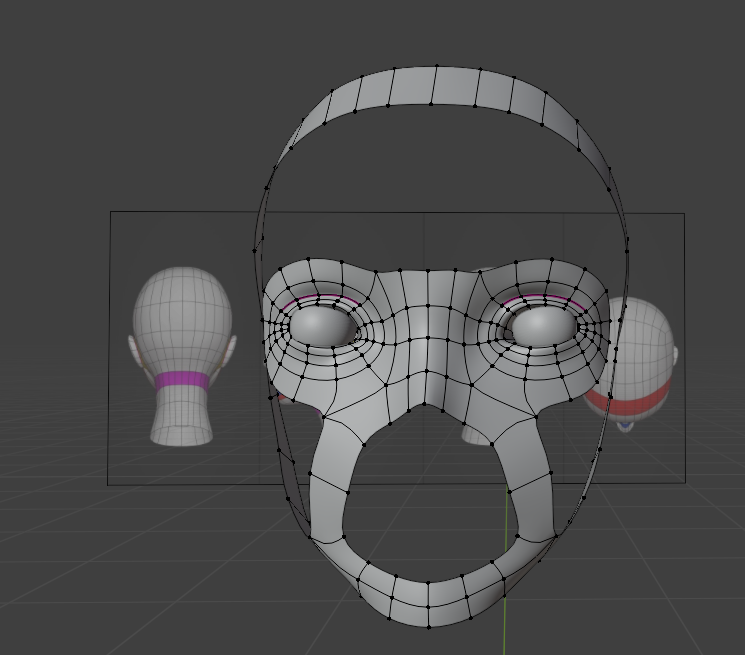
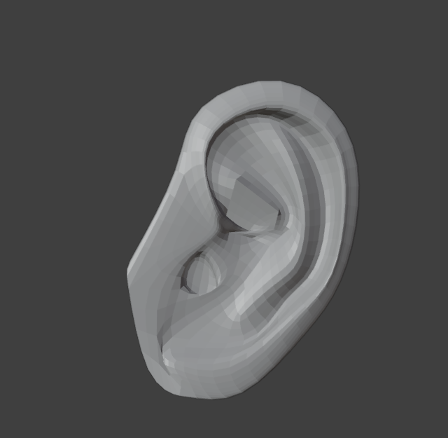
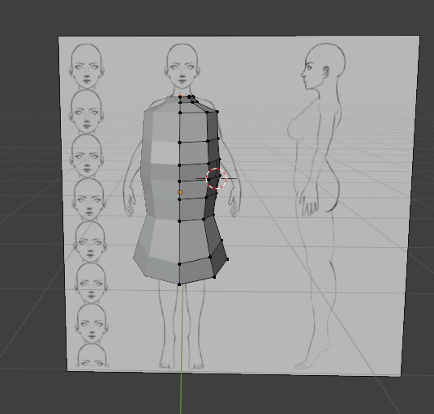
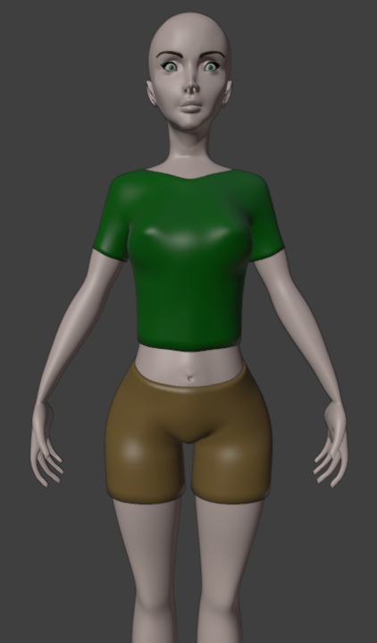

# 3D Persona
Persona model  

  

## Overview
The objective is to create a 3D persona that can move around. The project is developed using Blender 4.1.

## Software and Tools
- **Blender Version:** 4.1  
- **Blender Addons:** LoopTools (activated, but no additional plugins used)  
No specific configurations or environments are required for this project. Simply open Blender and begin your modeling process.

## Modeling Process
### Reference Setup
Gather reference images for both the body and head. I used [these references](https://www.patreon.com/posts/references-free-60842916?utm_medium=clipboard_copy&utm_source=copy_to_clipboard&utm_campaign=postshare).  

Scale the reference images to a height of 1.70 cm to match the intended height of the woman character. Duplicate the references and position them in front and to the left of a cube, simulating a modeling booth centered on the world origin. Ensure the head reference fits the body reference appropriately.  

### Head Modeling

  

Start by modeling the head using a plane and manipulating it to follow the coloured guidelines of the head reference. In order to model the surface better, use vertices, adjusting them according to the reference images. Repeat until you have the head (leave out the eye, mouth and ear area).

  
  

Then start modelling the eye, mouth and ear as separate entities. Use a circle to shape the eye and mouth regions. Create the eyeball with an UV sphere. Use an additional reference image to model the ears. Utilize proportional editing to refine curves and achieve a more natural look.

The final result:
.

### Body Modeling

  

Begin with a cylinder to model the body. Shape the torso by adjusting the vertices based on the reference images. When looking at the front reference, adjust only along the X-axis; for the side (left) reference, adjust only along the Y-axis. This ensures that the model retains correct proportions from all angles.

After shaping the torso, proceed to model the arms and legs. Finish by modeling the feet and hands, ensuring all body parts are proportionate and aligned correctly according to the reference images.

## Texturing
To apply textures accurately, I first had to unwrap the 3D model to create a UV map. This involves flattening the model's surface into a 2D space, allowing for detailed texture application. In Blender, this process involves marking the seams where you want to cut the UV map. After marking the seams, I used the "Unwrap" function to generate the UV map. The UV layout can then be adjusted as needed in the UV Editor to ensure efficient and accurate mapping of the texture.

Once the UV map was ready, I began texture painting. Blender’s texture painting tools allow you to paint directly onto the 3D model or on the texture image itself. To start, switch to Texture Paint Mode by selecting it from the mode menu. Use various brushes and tools to apply colors, textures, and details to the model. This process can be iterative, often requiring multiple adjustments to achieve the desired look.

  

## Materials and Shading
Creating and assigning materials to different parts of the model is essential for defining surface properties such as color, reflectivity, and roughness, to give the model a realistic appearance. In Blender, you can create materials by opening the Material Properties panel and clicking "New" to add a new material. You can also customized the material properties such as Base Color, Metallic, and Roughness to match the desired look.

Enhancing the visual quality of the model involves also setting up shaders. Blender’s Shader Editor allows you to combine different nodes to create complex material effects. To do so, I had to switch to the Shader Editor and add nodes like Principled BSDF, Image Texture, and Mix Shader to create the desired material effects. By carefully creating and assigning materials and setting up shaders, I could significantly enhance the realism and visual appeal of the 3D models.

## Rigging
Creating an armature, or skeleton, for the model is essential for animation. This skeleton will serve as the framework for animating the model, allowing for realistic movement and deformation. To create an armature in Blender, I started by adding a single bone to the scene. Switch to Edit Mode, then extrude new bones by selecting the tip of a bone and pressing E. Then I proceed to position and rotate the bones to match the anatomy of the model, ensuring that the bones are properly aligned with the parts of the model they will control.

Once the skeleton is complete, I had to parent the model to the armature by selecting both the model and the armature. You can complete the rigging by choosing to add automatic weights or paint them. This initial setup allowed the bones to control the mesh.

## Animation
See [ReadME](animation/README.md).
