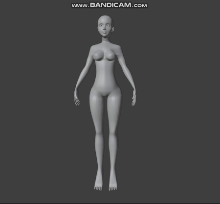

# 3D Persona
Persona model  

  

## Overview
The objective is to create a 3D persona that can move around. The project is developed using Blender 4.1.

## Software and Tools
- **Blender Version:** 4.1  
- **Blender Addons:** LoopTools, Curve: Extra object (activated, but no additional plugins used)  
No specific configurations or environments are required for this project. Simply open Blender and begin your modeling process.

## Modeling Process
### Reference Setup
Gather reference images for both the body and head. I used [these references](https://www.patreon.com/posts/references-free-60842916?utm_medium=clipboard_copy&utm_source=copy_to_clipboard&utm_campaign=postshare).  

Scale the reference images to a height of 1.70 cm to match the intended height of the woman character. Duplicate the references and position them in front and to the left of a cube, simulating a modeling booth centered on the world origin. Ensure the head reference fits the body reference appropriately.  

### Head Modeling

  

Start by modeling the head using a plane and manipulating it to follow the coloured guidelines of the head reference. In order to model the surface better, use vertices, adjusting them according to the reference images. Repeat until you have the head (leave out the eye, mouth and ear area).

  
  

Then start modelling the eye, mouth and ear as separate entities. Use a circle to shape the eye and mouth regions. Create the eyeball with an UV sphere. Use an additional reference image to model the ears. Utilize proportional editing to refine curves and achieve a more natural look.

### Body Modeling

  

Begin with a cylinder to model the body. Shape the torso by adjusting the vertices based on the reference images. When looking at the front reference, adjust only along the X-axis; for the side (left) reference, adjust only along the Y-axis. This ensures that the model retains correct proportions from all angles.

After shaping the torso, proceed to model the arms and legs. Finish by modeling the feet and hands, ensuring all body parts are proportionate and aligned correctly according to the reference images.

The final result:

  

### Clothing

To add clothes to the model, I first duplicated the body mesh to use as a base. For the t-shirt, I selected the upper torso area, extruded it outward, and then used the Solidify modifier to give it thickness. This method allowed me to closely follow the body contours, ensuring the t-shirt fit well.

For the pants, I selected the lower torso and leg regions, extruding them similarly to the t-shirt, and then applied the Solidify modifier. The pants required more adjustments, particularly around the waist and hips, to ensure a natural fit without any clipping through the body mesh.

Creating the boots involved a similar process. I selected the feet and lower leg regions, extruded them to form the boot shape, and applied the Solidify modifier. Additional tweaks were necessary around the ankles to ensure the boots looked realistic and fit snugly.

Throughout this process, frequent adjustments were necessary to refine the fit and appearance of the clothes, ensuring they looked natural and appropriate for the character.

### Hair

For the hair, I used Blender's curves to create individual strands. By manipulating the curves, I aimed to give each strand a natural movement and flow. To achieve this, I added torsions and bends, ensuring that the hair didn't look too rigid.

The initial curve setup had a high number of vertices and faces to capture detailed movement. However, this made the hair very heavy in terms of computational load. To optimize it, I reduced the number of vertices and faces towards the end of the process. This reduction was a balance between maintaining the hair's natural look and ensuring it was not too resource-intensive.

Despite the reduction in detail, the final hair model retained a realistic appearance, complementing the overall character design. The hair was styled to match the character's intended look while ensuring it fit well with the head and body proportions.

  

## Texturing
To apply textures accurately, I first unwrapped the 3D model to create a UV map. This involves flattening the model's surface into a 2D space, allowing for detailed texture application. In Blender, this process starts by marking the seams where the UV map will be cut. After marking the seams, I used the "Unwrap" function to generate the UV map. The UV layout can then be adjusted in the UV Editor as needed to ensure efficient and accurate mapping of the texture.

With the UV map ready, I began texture painting. Blender’s texture painting tools allow for direct painting onto the 3D model or on the texture image itself. To start, I switched to Texture Paint Mode from the mode menu. Using various brushes and tools, I applied colors, textures, and details to the model. This process is often iterative, requiring multiple adjustments to achieve the desired look.

  

## Materials and Shading
Creating and assigning materials to different parts of the model is essential for defining surface properties such as color, reflectivity, and roughness, which give the model a realistic appearance. In Blender, materials can be created by opening the Material Properties panel and clicking "New" to add a new material. Material properties like Base Color, Metallic, and Roughness can be customized to match the desired look.

Enhancing the visual quality of the model also involves setting up shaders. Blender’s Shader Editor allows for combining different nodes to create complex material effects. To achieve this, I switched to the Shader Editor and added nodes like Principled BSDF, Image Texture, and Mix Shader. By carefully creating and assigning materials and setting up shaders, I significantly enhanced the realism and visual appeal of the 3D models.

  

## Animation
See [ReadME](animation/README.md).
